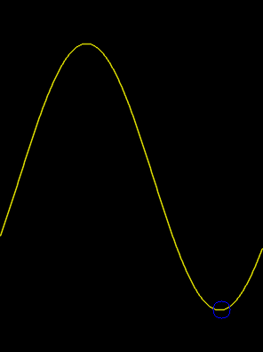

# Particle-Swarm-Optimization
Simple implementation of Particle Swarm Optimization

## required
* c++11

## usage

```
//
// Created by iceytan on 18-12-9.
//

#include <iostream>
#include "PSO.h"

int main()
{

    auto fx = [](int x)
    {
        return 150.0*sin( x*M_PI/150.0 - 0.5)+200.0;
    };

    
    PSO pso;

    pso.SetLossFunction([&](std::vector<double> input)->double{
       if (input[0]<0 || input[0]>=width) return 1000;
       return 150.0*sin( input[0]*M_PI/150.0 - 0.5)+200.0;
    });

// do pso
    auto r = pso.Process(50,51,20); // r[0] = 50.1488
}

```


